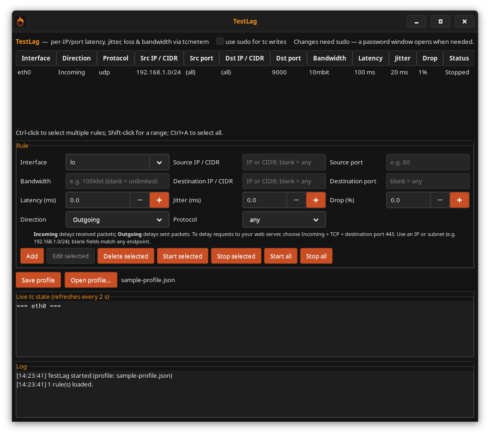

<p align="center">
  
</p>

<h1 align="center">TestLag</h1>

<p align="center">
  <em>Add latency, jitter, packet loss and bandwidth limits to specific network
  flows on Linux — from a GUI or a CLI.</em>
</p>

## About

Testing how software behaves on a bad network usually means either degrading
your whole machine or reaching for raw `tc` incantations that are easy to get
wrong and easy to leave behind. TestLag is a thin, honest front-end over
`tc`/netem that makes the common case quick and the state visible.

You define rules — *this interface, this flow, 300 ms of latency, 5 % loss* —
and start and stop them individually. Traffic that does not match a rule is
untouched, so you can put half a second of latency on one API endpoint while
SSH and your package manager stay fast.

The design is deliberately transparent: TestLag builds ordinary `tc` command
lines, shows you the live qdisc tree it produced, and never keeps state the
kernel does not have. Its qdisc layout uses `htb` classes with a `netem` leaf
per rule, so any number of rules can coexist on one interface, and each
interface is rebuilt from scratch on every change — applying a rule twice
produces the same result as applying it once.

Two consequences of shaping with netem are worth knowing before you start, and
both are covered in detail below: rules act on traffic **leaving** an interface
(egress), and qdiscs live in the kernel rather than in this process, so
TestLag reconciles what it saved against what the kernel actually has every
time it starts.

### Features

- Latency, jitter, packet loss and bandwidth limits, per rule
- Match flows by source and destination IP and port, in any combination
- Any number of rules per interface, started and stopped independently
- GTK3 GUI and a headless CLI over the same profile and the same `tc` state
- Live view of the qdisc and filter tree, refreshed as you work
- Rules persist as readable JSON, validated on load
- Applies each interface in a single privileged `tc` batch — one password
  prompt's worth of work, not ten
- Reconciles saved rules against live kernel state on start, and offers to
  tear shaping down on exit, so the UI never claims something the kernel is
  not doing
- Runs `tc` without a shell, without a `$PATH` lookup and without temp files
  (see [Security](#security))

## Requirements

**Runtime**

| | Fedora / RHEL | Debian / Ubuntu | Arch |
| --- | --- | --- | --- |
| `tc`, `ip` | `iproute`, `iproute-tc` | `iproute2` | `iproute2` |
| GTK 3 (GUI only) | `gtk3` | `libgtk-3-0` | `gtk3` |

> On Fedora, `tc` lives in **`iproute-tc`**, which is a separate package from
> `iproute` and is not always installed. The CLI works without GTK; only the
> GUI needs it.

**Build**

| | Fedora / RHEL | Debian / Ubuntu | Arch |
| --- | --- | --- | --- |
| compiler + make | `gcc`, `make` | `build-essential` | `base-devel` |
| pkg-config | `pkgconf-pkg-config` | `pkg-config` | `pkgconf` |
| GTK 3 headers | `gtk3-devel` | `libgtk-3-dev` | `gtk3` |
| GLib headers | `glib2-devel` | `libglib2.0-dev` | `glib2` |

**Kernel** — the `sch_netem`, `sch_htb` and `cls_flower` modules. They ship with
stock kernels on mainstream distributions and load on demand. Minimal and
cloud kernel builds sometimes package them separately: on Debian/Ubuntu cloud
images install `linux-modules-extra-$(uname -r)`, on RHEL/CentOS
`kernel-modules-extra`. Check with:

```sh
modinfo sch_netem sch_htb cls_flower >/dev/null && echo ok
```

The logo is embedded in the executable at build time using
`glib-compile-resources` (from the GLib development tools). The runtime binary
does not need an external `logo-banner.png`.

**Privileges** — reading `tc` state needs none; changing it needs root, via
either `sudo ./testlag` or per-command `sudo` (see [Run](#run)).

## Install

```sh
# Fedora / RHEL
sudo dnf install gcc make pkgconf-pkg-config gtk3-devel glib2-devel iproute iproute-tc

# Debian / Ubuntu
sudo apt install build-essential pkg-config libgtk-3-dev libglib2.0-dev iproute2

# Arch
sudo pacman -S --needed base-devel pkgconf gtk3 glib2 iproute2
```

Then:

```sh
git clone <this repository>
cd testlag
make                # builds ./testlag
./testlag           # run it from here
```

There is no install step and nothing is written outside the build directory.
To put it on your `PATH`, copy the binary and the logo together:

```sh
sudo install -m 0755 testlag /usr/local/bin/testlag
sudo install -m 0644 logo-banner.png /usr/local/bin/logo-banner.png
```

TestLag looks for `logo-banner.png` next to its own executable and then in the
working directory; without it the window simply has no icon.

### Build targets

```sh
make            # builds ./testlag
make test       # builds the headless backend test
make test-run   # runs the backend test in a private network namespace
make clean      # removes the binary, objects and test binary
```

## Quick start

```sh
# 300 ms of latency on everything leaving eth0
sudo ./testlag add --iface eth0 --latency 300 --active
ping <a host on that link>          # ~300 ms slower

sudo ./testlag list                 # see the rule and its state
sudo ./testlag status               # see the qdisc tree it built
sudo ./testlag stop all             # put the interface back
```

Or run `sudo ./testlag` with no arguments for the GUI: pick an interface, fill
in the effects, **Add**, then **Start**.

If a rule seems to do nothing, the two things to check first are the direction
it matches ([below](#which-direction-does-a-rule-shape)) and whether the
traffic uses that interface at all — `ip route get <ip>` answers the second,
and `local ... dev lo` means it never leaves the machine.

## Run

```sh
./testlag                          # GUI; opens a password dialog when needed
sudo ./testlag                     # optional: run the whole app as root
./testlag --profile /path/p.json   # custom profile file
./testlag --no-sudo                # never invoke sudo (must already be root)
```

- Unprivileged mode: read commands (`tc qdisc show`, `ip link`) run directly;
  GUI write commands use `sudo -A` with a password dialog built into TestLag.
  No terminal or separate askpass package is required. CLI commands continue
  to prompt in the terminal. Sudo controls authentication and credential caching;
  a cached authorization or passwordless policy may skip the dialog. Cancelling
  the dialog fails that command and reports the error in the app.
- Running as `sudo ./testlag` runs everything directly.
- Select multiple rules with Ctrl-click, Shift-click for a range, or Ctrl+A
  while the list is focused. **Start selected**, **Stop selected**, and
  **Delete selected** act on the selection, rebuilding each affected interface
  once. If stopping a rule fails, it remains in the list for retry instead of
  being deleted. Editing requires exactly one selected rule; double-clicking
  starts only that row.
- Closing the window asks for confirmation, and a confirmed exit **stops every
  active rule** before quitting: qdiscs live in the kernel, not in the process,
  so rules left running would keep shaping traffic after TestLag is gone. The
  rules themselves stay in the profile and can be started again next launch.
  If an interface cannot be cleared, the exit says so and names the `tc qdisc
  del` to run by hand. (A crash or `kill` skips this, which is what the
  active-state reconciliation on load is for -- see "Profile".)

## Which direction does a rule shape?

Rules select **outgoing** (the default) or **incoming** traffic. Source and
destination always describe the packet itself: for incoming traffic, the peer
is the source and this machine is the destination. Incoming rules use a managed
IFB device, an ingress qdisc and a redirect; the kernel also needs `ifb`,
`sch_ingress`, `cls_matchall` and `act_mirred` support. Existing foreign ingress
or clsact configurations and IFB name collisions are refused.

Both address fields accept IPv4/IPv6 addresses or CIDR subnets. Host bits in a
CIDR are masked, so `192.168.1.77/24` matches `192.168.1.0/24`. Protocol choices
are `any`, `tcp`, `udp`, `sctp`, `icmp` and `icmpv6`. With ports, `any` matches
TCP, UDP and SCTP in both IP families. ICMP rules cannot specify ports.

For example, delay incoming UDP packets from a subnet:

```sh
./testlag add --iface eth0 --direction incoming --protocol udp \
  --src-ip 192.168.1.0/24 --dst-port 9000 --latency 100 --active
```

For outgoing rules, "lag the devices hitting my web server" matches the replies
the server sends:

| what you want | source IP | source port | dest IP | dest port |
| --- | --- | --- | --- | --- |
| Lag everyone using my web server | — | `80` | — | — |
| Lag one device using my web server | — | `80` | that device | — |
| Lag what I fetch from a remote API | — | — | the API's IP | `443` |
| Lag one whole peer, both ways I send | — | — | that peer | — |
| Lag everything leaving this NIC | — | — | — | — |

A field left blank matches anything; all four blank is the all-traffic rule.

Because only the outbound half of a conversation is delayed, a peer sees the
configured latency added **once** per round trip, not twice.

Two things worth knowing when a rule seems to do nothing:

- **An address of this machine is reached over `lo`.** `ip route get <ip>` says
  which interface traffic actually takes; if it prints `local ... dev lo`, a
  rule on the physical NIC will never match, and the rule belongs on `lo`.
- **`tc -s filter show dev <iface>`** prints `(rule hit N success M)` per
  filter. `success 0` means the filter is being evaluated and matching nothing.

## CLI

`testlag` also runs headless — no GUI — to manage the profile and live `tc`
state. The same global options apply (`--profile P`, `--sudo`, `--no-sudo`).
Rule indices are 0-based, as shown by `list`.

```sh
testlag list                 # list rules (index, iface, ip, port, effects, state)
testlag ifaces               # list available network interfaces
testlag add --iface IFACE [rule opts]
testlag edit N [rule opts]   # update rule N (unspecified fields unchanged)
testlag del N                # delete rule N (stops it first if active)
testlag start N | all        # apply rule(s) via tc
testlag stop  N | all        # remove rule(s) from tc
testlag status               # show live tc state for the profile's interfaces
testlag help                 # show this help
```

Rule options for `add`/`edit`:

```
--iface IFACE     network interface (required for add; e.g. lo, eth0)
--src-ip IP       source IP (default: any) — an address of this machine
--src-port PORT   source port (default: any) — e.g. 80 for your own web server
--dst-ip IP       destination IP (default: any); --ip is an alias
--dst-port PORT   destination port (default: any); --port is an alias
--latency MS      latency in milliseconds, 0-60000 (default: 0)
--jitter MS       jitter in milliseconds, 0-60000 (default: 0)
--drop PCT        packet loss percent, 0-100 (default: 0)
--bandwidth RATE  netem rate, e.g. 100kbit, 1mbit (default: unlimited)
--active          (add only) start the rule immediately
```

Semantics mirror the GUI: `start`/`stop` mark the rule active/inactive and
rebuild the whole qdisc tree for its interface from all active rules (idempotent
convergence), so `start all`/`stop all` converge every interface at once. Every
mutating command (`add`, `edit`, `del`, `start`, `stop`) saves the profile
afterwards. `start N` on an already-active rule and `stop N` on a stopped rule
are no-ops.

Examples:

```sh
testlag add --iface lo --dst-ip 192.168.1.50 --dst-port 443 --latency 150 \
    --jitter 30 --drop 5 --bandwidth 100kbit
# lag every device using this machine's web server (delays its replies):
testlag add --iface eth0 --src-port 80 --latency 200
# ...or just one of them:
testlag add --iface eth0 --src-port 80 --dst-ip 192.168.1.77 --latency 200
testlag add --iface eth0 --latency 300 --active   # all-traffic, started now
testlag start 0
testlag stop all
testlag status
testlag del 2
```

## Profile

The rule set is loaded on start and saved on exit (and via the Save button)
as JSON:

```
~/.config/testlag/profile.json  (default; override with --profile P)
```

```json
{
  "version": 2,
  "rules": [
    {"iface":"eth0","direction":"outgoing","protocol":"any","src_ip":"","src_port":"","ip":"1.2.3.4","port":"443",
     "bandwidth":"100kbit","latency_ms":100,"jitter_ms":20,"drop_pct":5},
    {"iface":"eth0","direction":"outgoing","protocol":"any","src_ip":"","src_port":"80","ip":"","port":"",
     "bandwidth":"","latency_ms":300,"jitter_ms":0,"drop_pct":0}
  ]
}
```

`ip`/`port` are the **destination** match; they keep those names from before
source matching existed, so profiles written by older builds load unchanged
with empty source fields, outgoing direction and any protocol. A rule with all
four match fields empty and protocol `any` is an **all-traffic** rule for that
direction (no filter). Open/Save buttons in the
UI switch profile files.

A profile file is treated as untrusted input: every rule is validated when it
is loaded, and any rule with a malformed field is dropped (with a warning
naming it) while the rest of the profile still loads.

The profile also records which rules were running when it was saved, but the
qdisc tree lives in the kernel, not in the file. On load, the `active` flags
are reconciled against the live `tc` state (read-only): rules on an interface
that is not currently shaped by TestLag -- after a reboot, say -- are marked
stopped, so the displayed state matches reality and `start` applies them
again. Rules that are still applied (the process was restarted while shaping
was live) stay active.

## How it maps to tc

Each managed interface is rebuilt from scratch on every Start/Stop (idempotent
convergence):

```
tc qdisc del dev IF root                      # teardown
tc qdisc add dev IF root handle 1: htb default 1
tc class add dev IF parent 1: classid 1:1 htb rate 100gbit ceil 100gbit
# all-traffic rule (at most one per interface):
tc qdisc add dev IF parent 1:1 netem delay 300ms
# each specific rule gets its own class + netem + filter (classes 1:2, 1:3, ...):
tc class add dev IF parent 1: classid 1:2 htb rate 100gbit ceil 100gbit
tc qdisc add dev IF parent 1:2 netem delay 100ms 20ms loss 5% rate 100kbit
tc filter add dev IF parent 1: protocol ip pref 4 flower skip_hw \
    ip_proto tcp dst_ip 1.2.3.4/32 dst_port 443 classid 1:2
# source matching uses the same filter, on the other side of the packet:
tc filter add dev IF parent 1: protocol ip pref 6 flower skip_hw \
    ip_proto tcp src_port 80 classid 1:3
```

- `htb` root (not `prio`) so an unlimited number of per-IP/port rules fit per
  interface.
- With **no** all-traffic rule active, class `1:1` (the htb default) gets a
  `pfifo` pass-through qdisc so unmatched traffic is not dropped.
- Safety: an interface is only managed if its root qdisc is absent, `noqueue`,
  `fq_codel`, or `htb`; a foreign root qdisc is refused with a message.
- The whole tree is applied by a **single** `tc -batch` process rather than one
  `tc` per line: unprivileged, each command would otherwise be its own `sudo`,
  and so its own PAM/logind session (see "Security" below).
- The teardown `tc qdisc del` is skipped when the interface has no root qdisc
  of its own (`noqueue` is the kernel's placeholder, and `htb` goes straight
  over it), so a first Start costs one privileged command in total.
- Commands are never passed to a shell: the command string is split into an
  argv vector and the binary is exec'd directly (see "Security" below).

## Security

TestLag builds `tc` command lines from user input and often runs them as root,
so the execution path is deliberately narrow:

- **No shell.** Commands are split into an argv vector and exec'd directly
  (`g_spawn_sync`), so a value containing `;`, `|`, `` ` `` or `$()` can never
  become a second command, a redirect, or a substitution.
- **No `$PATH` lookup.** `tc`, `ip` and `sudo` are resolved against a fixed
  list of system directories, so an inherited `PATH` cannot decide which
  binary root executes. The child also gets a minimal environment.
- **Password handling.** The GUI launches the same executable as a separate
  askpass helper using its absolute path. Its masked entry sends the password
  directly to sudo over a pipe; passwords are never saved to profiles or logs,
  or passed in arguments or environment variables.
- **Untrusted profiles.** Rules loaded from a profile file go through the same
  validators as GUI and CLI input; invalid rules are dropped, never applied.
  `tc_apply_interface()` re-checks every rule as a last gate before exec.
- **Few privilege transitions.** An interface is rebuilt by one `tc -batch`
  process that reads its commands from stdin, not by seven to ten separate
  `tc` invocations. Unprivileged each of those was a separate `sudo`, i.e. a
  separate PAM/logind session; in bulk that is enough to exhaust a machine's
  file descriptors. The batch is data on a pipe, never a command line, and no
  validator admits a newline, so a value cannot open a batch line of its own
  (`tc_run_batch()` rejects one outright).
- **No temporary files.** Command output is read from pipes, and the batch is
  written to a pipe, so there is no predictable file in `/tmp` to race.

Running `sudo ./testlag` runs the whole process as root, so the profile file
and its directory should be writable only by you.

## Limitations

- The graphical password dialog changes how sudo requests authentication; it
  does not bypass sudo/PAM or fix host inotify/resource exhaustion.
- A single rule cannot mix IPv4 and IPv6 addresses.
- One all-traffic rule per interface and direction. Specific rules take priority;
  overlapping specific rules match in profile order.
- Incoming shaping requires an IFB device and exclusive use of the ingress qdisc.
- The `htb` "quantum of class is big" warning from the 100 gbit class rate is
  harmless and suppressed (command output is shown only on failure).

## Development

The backend (`tc` command building, validation, profile parsing) is separated
from the GUI and has no GTK dependency, so it is tested headlessly:

```sh
make test-run       # backend checks in a private network namespace
make test-ingress   # real IPv4/IPv6 incoming packet checks (requires Python 3)
```

This needs `unshare` (util-linux) and `ping` (iputils), and a kernel that
allows unprivileged user namespaces — the default on mainstream distributions.
Everything runs inside a private network namespace, so the test shapes a
throwaway `lo` and never touches your real interfaces.

| file | what lives there |
| --- | --- |
| `src/tc.c` | command building, validation, apply/clear, batch execution |
| `src/profile.c` | JSON profile save/load, with its own small parser |
| `src/cli.c` | headless commands |
| `src/ui.c` | GTK3 front-end |
| `src/askpass.c` | built-in sudo password dialog |
| `src/lag.h` | the `LagRule` / `LagProfile` types shared by all of them |

`make test-run` executes `unshare -r -n ./test/test_tc`, which in a private
network namespace verifies: interface discovery, input validators (including
injection rejection and the numeric ranges), whole-rule validation,
netem/filter command builders for source, destination and full four-tuple
matches (plus the IPv4/IPv6 mixing guard), batch mode (including its newline
guard), applying both rule types (state shows `htb` +
both `netem` delays), stopping a specific rule (its delay gone, all-traffic
kept), clearing (back to `noqueue`), the specific-only pass-through path
(unmatched `ping` still succeeds), a full profile save/load round-trip of all
fields, and that a hostile profile file loads its one valid rule while
dropping the injected ones without executing anything.

`make test-run` also checks GUI/CLI sudo routing and failed teardown with
intercepted process launches, without requesting credentials. `make test-gui`
checks the password dialog on a graphical test display (Xvfb or Broadway),
using a fake password: submission, Cancel, window close, and empty input.

## Contributing

Issues and pull requests are welcome. Two things make review easy:

- `make test-run` passes, and new behaviour comes with a case in
  `test/test_tc.c`.
- The build stays warning-free under the flags in the `Makefile`
  (`-Wall -Wextra`, plus the hardening set).

Anything that changes how a `tc` command is built is security-relevant —
please read the [Security](#security) section first and keep the "no shell, no
`$PATH`, validated input" properties intact.

## License

[MIT](LICENSE) © 2026 ChainFire Labs.

Source files carry an `SPDX-License-Identifier: MIT` header. TestLag links
against GTK 3 and GLib, which are LGPL-2.1-or-later — that permits linking
from software under any license, so nothing in this project's dependencies
constrains your use of it. `tc` and `ip` are executed as separate programs,
not linked, so iproute2's GPL-2.0 does not reach this code either.
